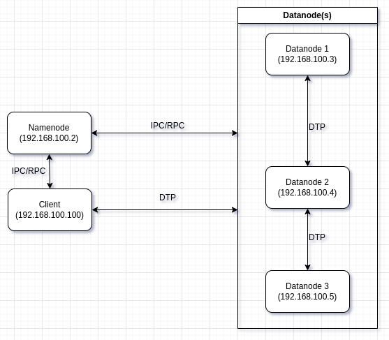
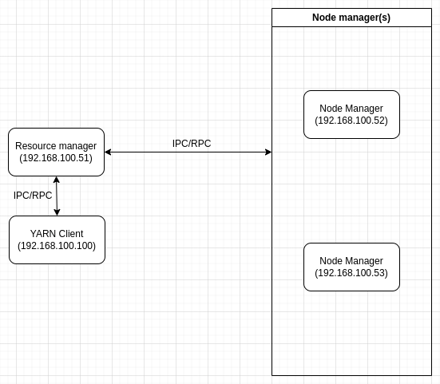

# Simple HDFS/YARN Multi-nodes cluster deployed on  a set of docker containers

This is a small unsecured cluster i use personnally to test new functionalities on new releases of hadoop...

## How to deploy it ?

```
cd hadoop-developer-starterkit
docker compose up --build --detach

# a little workaround to resolve containers name on the host - must be applied as a root
sudo bash -c "awk '/hostname/ {h=\$2} /ipv4_address/ {printf \"%s %s\n\", \$2, h}' compose.yaml >> /etc/hosts"
```
## How to undeploy it ?
```
docker compose down --volumes --remove-orphans
```

## Component(s) version(s) 
```
Docker image used : https://registry.hub.docker.com/layers/apache/hadoop/3/images/sha256-793348d0839a55d27fb9466d4a5f7e058744866f5ab2cb7aa32f541b4810b215?context=explore

Hadoop : 3.3.5

Java : 1.8.0_212

Client: Docker Engine - Community
 Version:           23.0.1
 API version:       1.42
 Go version:        go1.19.5
 Git commit:        a5ee5b1
 Built:             Thu Feb  9 19:47:01 2023
 OS/Arch:           linux/amd64
 Context:           default

 runc:
  Version:          1.1.4
  GitCommit:        v1.1.4-0-g5fd4c4d

 docker-init:
  Version:          0.19.0
  GitCommit:        de40ad0

 buildx: Docker Buildx (Docker Inc.)
   Version:  v0.10.2
   
 compose: Docker Compose (Docker Inc.)
   Version:  v2.16.0
   
 scan: Docker Scan (Docker Inc.)
   Version:  v0.23.0

```

## Namenode(s), Datanode(s), ResourceManager(s) and NodeManager(s) Web UI 

 - [**HDFS Namenode web UI**](http://namenode-1:9870)

 - [**HDFS Datanode N° 1 web UI**](http://datanode-1:9864)

 - [**HDFS Datanode N° 2 web UI**](http://datanode-2:9864)

 - [**HDFS Datanode N° 3 web UI**](http://datanode-3:9864)

 - [**YARN ResourceManager web UI**](http://resourcemanager-1:8088)

 - [**YARN NodeManager N° 1 web UI**](http://nodemanager-1:8042/)

 - [**YARN NodeManager N° 2 web UI**](http://nodemanager-2:8042/)

## Quick Test 

A simple Hello world file on HDFS ! XD
```
docker exec -it hadoop-developer-starterkit-edge-1-1 bash

# put a simple Hello Wolrd ! in hdfs
echo 'Hello World !' | hdfs dfs -put - /newfile.txt
# and then show it
hdfs dfs -cat /newfile.txt

# or maybe a quick way to generate a dumb file of 1GB
filename=$(cat /dev/urandom | tr -dc 'a-zA-Z0-9' | fold -w 10 | head -n 1); dd if=/dev/urandom of="$filename" bs=1M count=100 && hdfs dfs -put "$filename" / && rm "$filename"

# connect to the edge node
docker exec -it hadoop-developer-starterkit-edge-1-1 bash

# put a simple file on hdfs as an input for the map-reduce job to run on yarn
echo 'Hadoop is the Elephant King! \\nA yellow and elegant thing.\\nHe never forgets\\nUseful data, or lets\\nAn extraneous element cling! ' | hdfs dfs -put - /input.txt

# run a simple map-reduce job on yarn (wordcount example)
yarn jar /opt/hadoop/share/hadoop/mapreduce/hadoop-mapreduce-examples-3.3.1.jar wordcount /input.txt /output
```

## Useful commands

```
# open an interactive bash session on the container of hdfs namenode
docker exec -it hadoop-developer-starterkit-namenode-1 bash

# open an interactive bash session on the container of the first hdfs datanode
docker exec -it hadoop-developer-starterkit-datanode-1-1 bash

# open an interactive bash session on the container of second hdfs datanode
docker exec -it hadoop-developer-starterkit-datanode-2-1 bash

# open an interactive bash session on the container of third hdfs datanode
docker exec -it hadoop-developer-starterkit-datanode-3-1 bash

# open an interactive bash session on the container of edge
docker exec -it hadoop-developer-starterkit-edge-1-1 bash

# open an interactive bash session on the container of yarn resourcemanager
docker exec -it hadoop-developer-starterkit-resourcemanager-1-1 bash

# open an interactive bash session on the container of yarn node manager 1
docker exec -it hadoop-developer-starterkit-nodemanager-1-1 bash

# open an interactive bash session on the container of yarn node manager 2
docker exec -it hadoop-developer-starterkit-nodemanager-2-1 bash
```

## Simple HDFS Cluster




## The internal ports used by a HDFS Namenode(s) are:

```
Proto Recv-Q Send-Q Local Address           Foreign Address         State       User       Inode      PID/Program name                  
tcp        0      0 0.0.0.0:9870            0.0.0.0:*               LISTEN      1000       95772      14/java             
tcp        0      0 192.168.100.2:8020      0.0.0.0:*               LISTEN      1000       95790      14/java             
tcp        0      0 192.168.100.2:8020      192.168.100.4:51728     ESTABLISHED 1000       113288     14/java             
tcp        0      0 192.168.100.2:8020      192.168.100.5:47282     ESTABLISHED 1000       113287     14/java             
tcp        0      0 192.168.100.2:8020      192.168.100.3:43566     ESTABLISHED 1000       113289     14/java   
```

 - **9870 :** HDFS Namenode web UI (HTTP Protocol).
 - **8020 :** HDFS Namenode IPC/RPC interface

## The internal ports used by a HDFS Datanode(s) are:

```
Proto Recv-Q Send-Q Local Address           Foreign Address         State       User       Inode      PID/Program name    
tcp        0      0 0.0.0.0:9864            0.0.0.0:*               LISTEN      1000       103332     14/java             
tcp        0      0 0.0.0.0:9866            0.0.0.0:*               LISTEN      1000       114859     14/java             
tcp        0      0 0.0.0.0:9867            0.0.0.0:*               LISTEN      1000       92786      14/java             
```

 - **9864:** port used for browsing the status and data on a datanode (HTTP Protocol).
 - **9866:** port used for communication between Datanodes for transferring blocks (DTP Protocol).
 - **9867:** The datanode IPC/RPC server address and port.

## Client and Namenode and Datanode Communication:

```
Proto Recv-Q Send-Q Local Address           Foreign Address         State       User       Inode      PID/Program name      
tcp        0  65047 192.168.100.100:48062   192.168.100.4:9866      ESTABLISHED 1000       159033     2017/java       
tcp        0      0 192.168.100.100:42354   192.168.100.2:8020      ESTABLISHED 1000       105980     2017/java                
                
```
 - **8020:** port used for communication between the client and Namenode (RPC/IPC Protocol).
 - **9866:** port used for communication between the client and Datanodes for reading or writing data (DTP Protocol).

## Simple YARN Cluster



## The internal ports used by a YARN Resource manager are :

```
Proto Recv-Q Send-Q Local Address           Foreign Address         State       User       Inode      PID/Program name    
tcp        0      0 192.168.100.51:8088     0.0.0.0:*               LISTEN      1000       835127     14/java             
tcp        0      0 192.168.100.51:8033     0.0.0.0:*               LISTEN      1000       826472     14/java             
tcp        0      0 192.168.100.51:8032     0.0.0.0:*               LISTEN      1000       819590     14/java             
tcp        0      0 192.168.100.51:8031     0.0.0.0:*               LISTEN      1000       821668     14/java             
tcp        0      0 192.168.100.51:8030     0.0.0.0:*               LISTEN      1000       821672     14/java            
tcp        0      0 192.168.100.51:8031     192.168.100.53:34414    ESTABLISHED 1000       829420     14/java             
tcp        0      0 192.168.100.51:8031     192.168.100.52:60458    ESTABLISHED 1000       833744     14/java

```

 - **8088:** port used as web user interface, which allows users to monitor the cluster's status and view job statistics(HTTP). 
 - **8030:** port used to schedule resources for running applications (RPC Protocol).
 - **8031:** port used to track the status of the cluster's nodes and their available resources (RPC Protocol).
 - **8032:** port used by application manager interface (RPC Protocol).
 - **8033:** port used for the admin interface (RPC Protocol).
 

# The internal ports used by Yarn Node manager are : 

```
Proto Recv-Q Send-Q Local Address           Foreign Address         State       User       Inode      PID/Program name   
tcp        0      0 0.0.0.0:42839           0.0.0.0:*               LISTEN      1000       1226051    14/java             
tcp        0      0 0.0.0.0:13562           0.0.0.0:*               LISTEN      1000       1228932    14/java           
tcp        0      0 0.0.0.0:8042            0.0.0.0:*               LISTEN      1000       1228097    14/java             
tcp        0      0 0.0.0.0:8040            0.0.0.0:*               LISTEN      1000       1213600    14/java         
tcp        0      0 192.168.100.52:33914    192.168.100.51:8031     ESTABLISHED 1000       1206721    14/java  
```

 - **8040:**  port used to download application dependencies, such as jars and configuration files, from the Resource Manager (RPC Protocol)
 - **8042:** port used as web user interface, which allows users to monitor the Node Manager (HTTP Protocol).


## Client and Resource Manager and Node Manager Communication:

```
Active Internet connections (servers and established)
Proto Recv-Q Send-Q Local Address           Foreign Address         State       User       Inode      PID/Program name
tcp        0      0 192.168.100.100:51844   192.168.100.51:8032     ESTABLISHED 1000       1368400    504/java       
tcp        0      0 192.168.100.100:43016   192.168.100.53:40035    ESTABLISHED 1000       1393166    504/java            
```